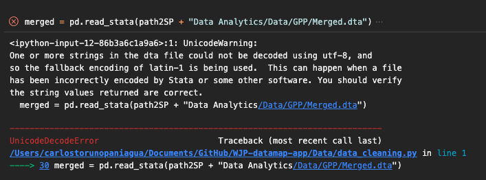

**Issue recorded by: Carlos A. Toruño Paniagua**

## Problem:
The `merged.dta` file has being merged using data sets from different countries, years and even polling companies. Given that the string variables have never being subject of attention and that this data set has never being read in other software different to Stata, the string variables have diffferent encoding sets that can only be read in STATA. For different country-year sets, the string variables are encoded using different encoding systems (utf-8, latin1, windows-1252, etc). This causes that, when trying to load the data from outside STATA, the software crashes. Fixing this issue would take too much time so we need a very simple solution to be able to read it.



## Solution:
Given that we can only read the data from within STATA, we need to use STATA's encoding tools:

1. Change the current working directory to the folder where the merged.dta file is stored

    ```
     cd "{path2SP}/Data Analytics/Data/GPP/"
    ```

2. Run the encoding analysis

    ```
    unicode analyze Merged.dta
    ```

3. Set a source encoding. We use "windows-1252" as the source encoding given that this encoding system will be the most common one in the data. However, this will produce string mistranslations for the chunks of data that are endoded using this system.

    ```
    unicode encoding set "windows-1252"
    ```

4. Translate the data to UTF-8
    ```
    unicode translate Merged.dta, transutf8
    ```

After the translation, you will be able to see a new folder in the working directory called `bak.stunicode`. In this folder you will have a back-up file from the original `merged.dta` file. Now, you can read the `merged.dta` file in R, Python and Julia. Just make sure of always check for potential mistranslations.

## Additional Notes:
None.